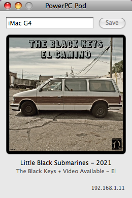

<p align="center"></p>

# PowerPC Pod

### Disclaimer: This project built entirely through AI-assisted development!<br>Sorry, I can't call it 'slop'.

An AirPlay 1 receiver with a native Cocoa GUI, built to run on a real PowerPC Mac (developed and tested against a 700MHz iMac G4 running Mac OS X 10.5 Leopard). Advertises itself over Bonjour (`_raop._tcp`), accepts a real AirPlay 1 RTSP/RTP session (RSA-OAEP session key recovery, AES-CBC decrypt, ALAC decode), and plays audio via CoreAudio. Now-playing metadata (title/artist/album, cover art) and connection status are shown in a small window; the device name shown there and advertised over Bonjour defaults to the Mac's own hostname on first launch and can be edited and saved.

<p align="center"></p>

## Requirements to build

- Docker, running on a normal x86_64/arm64 Linux or Mac host (the actual cross-compiler runs inside a container - `powerpc-apple-darwin9` GCC cannot run natively on this era's host hardware).
- The Mac OS X 10.5 SDK (see "Getting the SDK" below).
- `vendor/mbedtls-src` and `vendor/mbedtls/lib-ppc` (see "Getting the vendored dependencies" below).
- A real (or virtual) PowerPC Mac running 10.4+ to actually run the built app on - this project cannot execute PowerPC code on the build host at all, only compile and link it.

## Getting the SDK

`sdk/` is gitignored - it's Apple's proprietary SDK, and its license does not permit redistributing it outside Apple's own channels, so it's never committed to this repo. To get it, you need access to a Mac with Xcode 3.1.4 installed (the last Xcode version with full PowerPC/Mac OS X 10.5 SDK support) - either a real Leopard-era Mac or a compatible VM:

```
# On the Xcode 3.1.4 machine:
cd /Developer/SDKs
tar czf MacOSX10.5.sdk.tar.gz MacOSX10.5.sdk

# Copy the resulting tarball into this repo:
scp MacOSX10.5.sdk.tar.gz your-dev-machine:/path/to/ppc-pod/sdk/
```

`docker/Dockerfile` expects exactly `sdk/MacOSX10.5.sdk.tar.gz` and extracts it during the image build below.

## Getting the vendored dependencies

`vendor/` is gitignored too (third-party source + prebuilt binaries, kept out of this repo so it stays to this project's own code):

```
git clone --branch v2.28.8 https://github.com/Mbed-TLS/mbedtls.git vendor/mbedtls-src
```

(Check the actual tag on GitHub if `v2.28.8` doesn't exist.)

## Building the cross-compiler image

```
./docker/build.sh
```

Builds a Docker image containing a real `powerpc-apple-darwin9` GCC 6.1.0 toolchain with the 10.5 SDK baked in. `docker/ppc-cc` is a thin wrapper that runs any compile through this image.

## Rebuilding mbedtls for PowerPC

Needed once, before the first app build:

```
docker run --rm -v "$(pwd)":/src ppc-pod-toolchain bash -c '
  cd /src/vendor/mbedtls-src/library && \
  make CC=/opt/osxcross/target/bin/powerpc-apple-darwin9-gcc \
       AR=/opt/osxcross/target/bin/powerpc-apple-darwin9-ar \
       RL=/opt/osxcross/target/bin/powerpc-apple-darwin9-ranlib \
       APPLE_BUILD=1
'
```

Then copy the resulting `.a` files into `vendor/mbedtls/lib-ppc/`.

## Building and deploying the app

```
./docker/ppc-cc -Os -ffunction-sections -fdata-sections -Wl,-dead_strip \
  -I vendor/mbedtls-src/include -I src \
  src/ppc_pod_gui_main.m src/cocoa_ui.m src/login_items.m \
  src/airplay_main.c \
  src/airplay_dmap.c src/airplay_rtsp.c src/airplay_rtp.c src/airplay_rsa.c src/airplay_session.c src/alac.c \
  src/app_state.c src/app_settings.c \
  src/mdns.c src/coreaudio_output.c \
  vendor/mbedtls/lib-ppc/libmbedtls.a vendor/mbedtls/lib-ppc/libmbedx509.a vendor/mbedtls/lib-ppc/libmbedcrypto.a \
  -framework Cocoa -framework Foundation -framework CoreServices -framework AudioToolbox -framework CoreFoundation \
  -o ppc_pod_ppc

./docker/make_app_bundle.sh ppc_pod_ppc .

file "PowerPC Pod.app/Contents/MacOS/PowerPCPod"   # confirm: Mach-O ppc executable

scp -r "PowerPC Pod.app" your-ppc-mac:/Applications/
```

Once copied to `/Applications`, it's a normal double-click-to-run app - no separate install or pairing step. It registers itself as a Login Item on first launch so it starts automatically on login.

## Changing the app icon

`resources/AppIcon.icns` is already built and included. To use a different icon, replace the PNGs in `resources/icon_sources/` (16/32/48/128/256/512px) and run:

```
./docker/make_icns.sh
```

## Project layout

```
src/                            all source (Objective-C + C)
  ppc_pod_gui_main.m            process entry point (main()), spawns the AirPlay
                                backend thread, runs the Cocoa UI
  cocoa_ui.m/.h                 the window: device name field, now-playing display
  airplay_main.c                AirPlay TCP listener / connection lifecycle
  airplay_rtsp.c/.h             RTSP handshake, SET_PARAMETER, DMAP metadata push
  airplay_rtp.c/.h              RTP audio packet receive + decrypt + decode + output
  airplay_rsa.c/.h              RSA-OAEP session key recovery
  airplay_session.c/.h          per-connection session state
  airplay_dmap.c/.h             DMAP (iTunes metadata format) parser
  alac.c/.h                     Apple Lossless decoder
  coreaudio_output.c/.h         CoreAudio playback
  app_state.c/.h                shared state between the backend thread and the UI
  app_settings.c/.h             device name persistence (settings.txt) + hostname default
  login_items.m/.h              Login Items registration
  mdns.c/.h                     Bonjour/mDNS responder
docker/                         cross-compile toolchain (Dockerfile, ppc-cc wrapper,
                                make_app_bundle.sh, make_icns.sh)
resources/icon_sources/         icon artwork at every needed size
resources/AppIcon.icns          app icon
sdk/                            the Mac OS X 10.5 SDK - gitignored, see "Getting the SDK"
vendor/                         mbedtls (source + prebuilt PowerPC libs) - gitignored,
                                see "Getting the vendored dependencies"
```
